# Laporan Pemograman Mobile
Nama : Diantoro Kadarman

NIM  : 2241720084
## Praktikum 1
### Langkah 1 & 2

Kode tersebut menginisialisasi sebuah list (array) dengan tiga elemen [1, 2, 3]. Pada langkah pertama, assert digunakan untuk memverifikasi bahwa panjang list adalah 3 dan elemen pada indeks 1 memiliki nilai 2, yang keduanya benar sehingga program berjalan tanpa masalah. Kemudian, program mencetak panjang list (3) dan elemen pada indeks 1 (2). Selanjutnya, elemen pada indeks 1 diubah menjadi 1, dan assert kembali memastikan perubahan tersebut benar. Terakhir, program mencetak nilai baru dari elemen pada indeks 1, yaitu 1. Semua langkah berjalan tanpa error, dan outputnya adalah 3, 2, dan 1

### Langkah 3
Terjadi error karena tipe data var list adalah defaultnya null. Solusinya adalah mengubah tipe data array list menjadi ```Link<dynamic>```

## Praktikum 2
### Langkah 1 & 2
Ketika di run, isi dari variable halogens di print sesuai isinya yaitu ```{'fluorine', 'chlorine', 'bromine', 'iodine', 'astatine'}```

### Langkah 3
Tidak terjadi error ketika di run, hanya saja variable variable tersebut berisi null

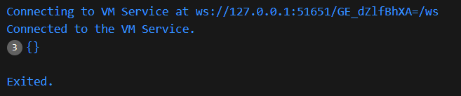

Menambahkan elemen nama dan NIM menggunakan ```.add()``` dan ```.addAll()```

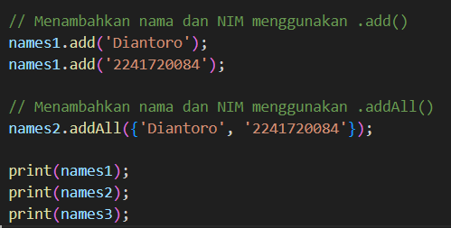

Hasil
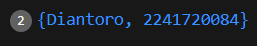


## Praktikum 3
### Langkah 1 & 2
Tidak terjadi error, variable gifts berisi pasangan kunci (key) berupa string dengan nilai (value) berupa string dan angka, sedangkan nobleGases berisi pasangan kunci berupa angka dengan nilai berupa string dan angka. Kemudian kedua variable diatas di print

### Langkah 3
Tidak terjadi error, namun variabel mhs 1 dan 2 tidak digunakan sama sekali

#### Menambahkan elemen nama dan NIM
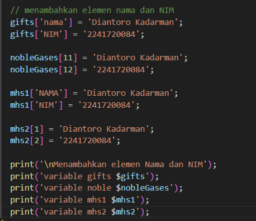

hasil
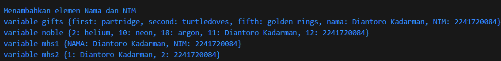

## Praktikum 4
### Langkah 1 & 2
Terjadi error dikarenakan variable ```list1``` belum di inisialisasi

Perbaikan

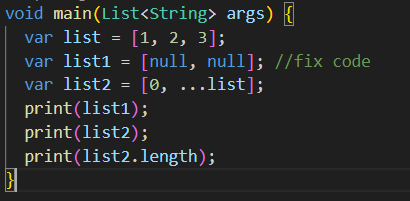

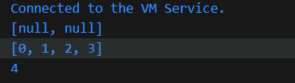

### Langkah 3 
Terjadi error karena variable list1 belum di deklrasi

menambahkan deklarasi 

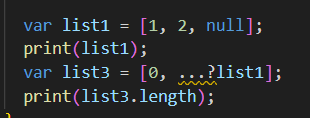

output

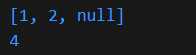

Menambahkan variable list berisi NIM menggunakan Spread Operator

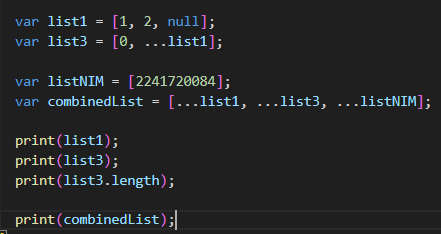

output 

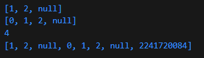

### Langkah 4
Terjadi error karena varable ```promoActive``` belum di deklarasikan

variable ```promoActive``` bernilai ```true```

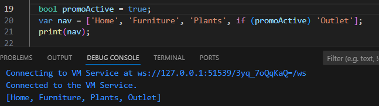

variable ```promoActive``` bernilai ```false```

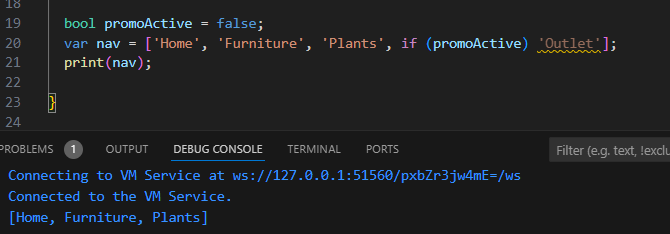

Jika variable ```promoActive``` bernilai ```true``` maka akan mengeprint kata Outlet dan ketika bernilai ```false``` maka tidak akan mengeprint kata Outlet

### Langkah 5
Terjadi error karena variable ```login``` belum di deklarasi

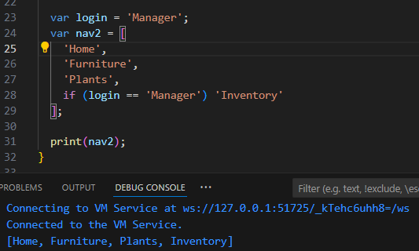

Jika kondisi ```if``` bernilai ```true``` maka akan mengeprint kata Inventory, jika bernilai ```false``` maka tidak akan mengeprint Inventory

### Langkah 6
Tidak terjadi error, manfaat dari Collection For adalah untuk menambahkan elemen-elemen ke dalam list (atau koleksi lainnya) secara dinamis berdasarkan kondisi atau iterasi. Ini sangat mempermudah penulisan kode yang lebih bersih dan efisien dalam kasus di mana kita ingin menambahkan elemen-elemen ke sebuah koleksi berdasarkan loop atau kondisi.


## Praktikum 5
### Langkah 1 & 2
Terjadi eror karenna setelah print tidak terdapat tanda ```;```. Setelah perbaikan output yang dihasilkan yaitu mencetak variabel record namun yang tercetak lebih dulu adalah yang bertipe data String terlebih dahulu

### Langkah 3
Tidak terjadi error, namun jika di run tidak ada yang di print karena belum diisi

Penggunaan fungsi ```tukar()```

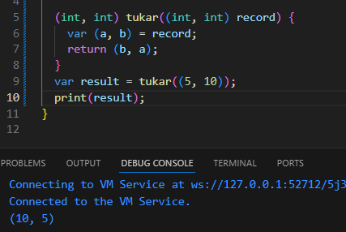

### Langkah 4
Terjadi error karena var ```mahasiswa``` belum di inisialisasi

Inisialisasi nama dan NIM pada variable record ```mahasiswa```

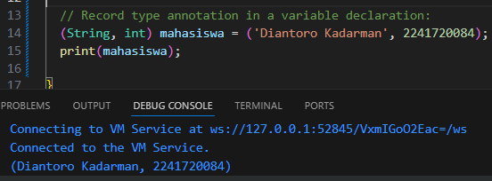

### Langkah 5
Tidak ada error, output yang dihasilkan adalah output dari var ```mahasiswa2```

Mengganti isi record dengan nama dan NIM

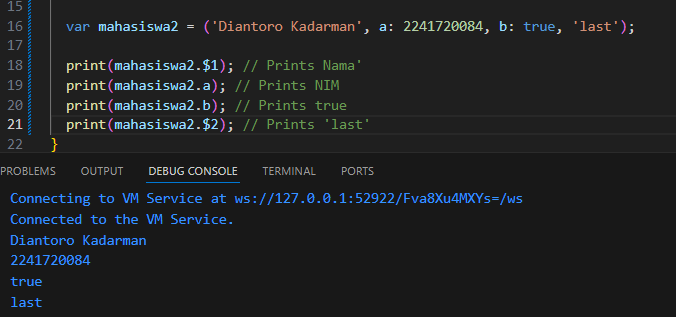


# Tugas Praktikum 
### 1. Jelaskan yang dimaksud Functions dalam bahasa Dart!
Jawab :

### 2. Jelaskan jenis-jenis parameter di Functions beserta contoh sintaksnya!
Jawab :

### 3. Jelaskan maksud Functions sebagai first-class objects beserta contoh sintaknya!
Jawab :

### 4. Apa itu Anonymous Functions? Jelaskan dan berikan contohnya!
Jawab :

### 5. Jelaskan perbedaan Lexical scope dan Lexical closures! Berikan contohnya!
Jawab :

### 6. Jelaskan dengan contoh cara membuat return multiple value di Functions!
Jawab :