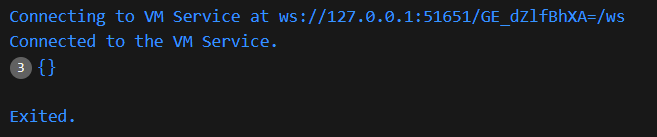
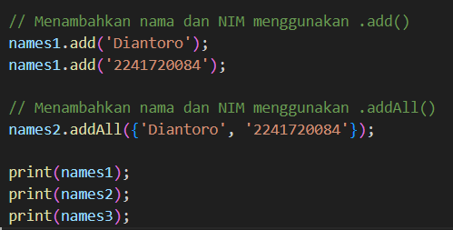
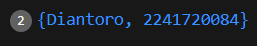

# Laporan Pemograman Mobile
Nama : Diantoro Kadarman
NIM  : 2241720084
## Praktikum 1
#### Langkah 2

Kode tersebut menginisialisasi sebuah list (array) dengan tiga elemen [1, 2, 3]. Pada langkah pertama, assert digunakan untuk memverifikasi bahwa panjang list adalah 3 dan elemen pada indeks 1 memiliki nilai 2, yang keduanya benar sehingga program berjalan tanpa masalah. Kemudian, program mencetak panjang list (3) dan elemen pada indeks 1 (2). Selanjutnya, elemen pada indeks 1 diubah menjadi 1, dan assert kembali memastikan perubahan tersebut benar. Terakhir, program mencetak nilai baru dari elemen pada indeks 1, yaitu 1. Semua langkah berjalan tanpa error, dan outputnya adalah 3, 2, dan 1

#### Langkah 3
Terjadi error karena tipe data var list adalah defaultnya null. Solusinya adalah mengubah tipe data array list menjadi ```Link<dynamic>```

## Praktikum 2
#### Langkah 2
Ketika di run, isi dari variable halogens di print sesuai isinya yaitu ```{'fluorine', 'chlorine', 'bromine', 'iodine', 'astatine'}```

#### Langkah 3
Tidak terjadi error ketika di run, hanya saja variable variable tersebut berisi null


Menambahkan elemen nama dan NIM menggunakan ```.add()``` dan ```.addAll()```


Hasil



## Praktikum 3
#### Langkah 2
tidak terjadi error, variable gifts berisi pasangan kunci (key) berupa string dengan nilai (value) berupa string dan angka, sedangkan nobleGases berisi pasangan kunci berupa angka dengan nilai berupa string dan angka. Kemudian kedua variable diatas di print

#### Langkah 3
