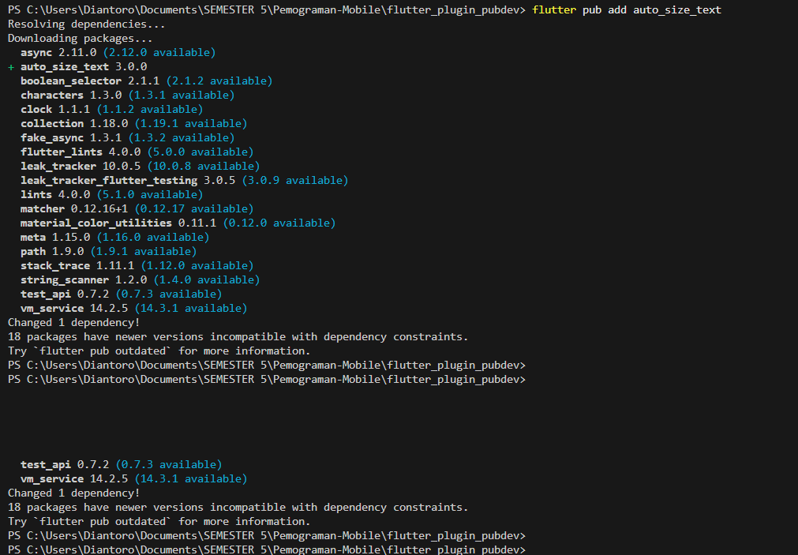
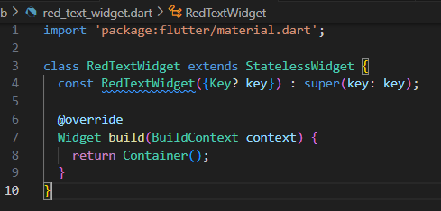
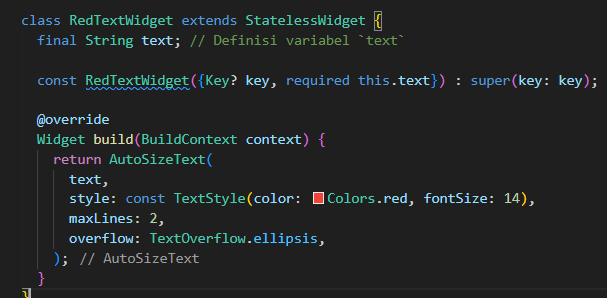
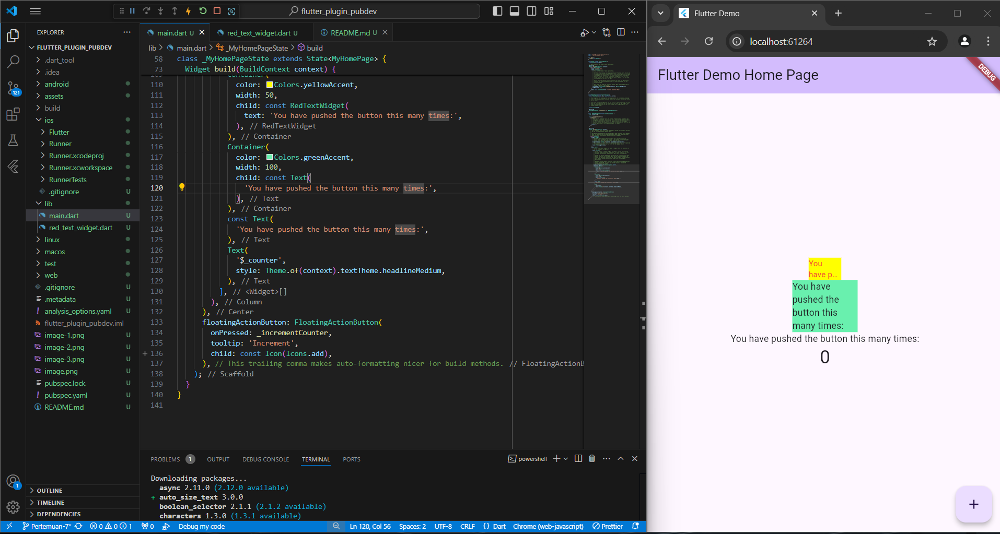

## **3. Praktikum Menerapkan Plugin di Project Flutter**

Selesaikan langkah-langkah praktikum berikut ini menggunakan editor Visual Studio Code (VS Code) atau Android Studio atau code editor lain kesukaan Anda.

Perhatian: Diasumsikan Anda telah berhasil melakukan setup environment Flutter SDK, VS Code, Flutter Plugin, dan Android SDK pada pertemuan pertama.

## **Langkah 1: Buat Project Baru**
Buatlah sebuah project flutter baru dengan nama flutter_plugin_pubdev. Lalu jadikan repository di GitHub Anda dengan nama flutter_plugin_pubdev.

## **Langkah 2: Menambahkan Plugin**
Tambahkan plugin auto_size_text menggunakan perintah berikut di terminal



flutter pub add auto_size_text
Jika berhasil, maka akan tampil nama plugin beserta versinya di file pubspec.yaml pada bagian dependencies.

## **Langkah 3: Buat file red_text_widget.dart**
Buat file baru bernama red_text_widget.dart di dalam folder lib lalu isi kode seperti berikut.



## **Langkah 4: Tambah Widget AutoSizeText**
Masih di file red_text_widget.dart, untuk menggunakan plugin auto_size_text, ubahlah kode return Container() menjadi seperti berikut.


Setelah Anda menambahkan kode di atas, Anda akan mendapatkan info error. Mengapa demikian? Jelaskan dalam laporan praktikum Anda!

### **Penjelasan**
Error terjadi karena:

text tidak didefinisikan. Ganti text dengan teks statis, misal 'Sample Text'.
AutoSizeText belum diimpor. Tambahkan import 'package:auto_size_text/auto_size_text.dart';.

## **Langkah 5: Buat Variabel text dan parameter di constructor**
Tambahkan variabel text dan parameter di constructor seperti berikut.



## **Langkah 6: Tambahkan widget di main.dart**
Buka file main.dart lalu tambahkan di dalam children: pada class _MyHomePageState
Run aplikasi tersebut dengan tekan F5, maka hasilnya akan seperti berikut.



## **8. Tugas Praktikum**
**1. Selesaikan Praktikum tersebut, lalu dokumentasikan dan push ke repository Anda berupa screenshot hasil pekerjaan beserta penjelasannya di file README.md!**
<br>

**2. Jelaskan maksud dari langkah 2 pada praktikum tersebut!**
<br>
**Jawab :**<br> 
Perintah flutter pub add auto_size_text mempermudah proses penambahan paket ke dalam proyek Flutter Anda dengan satu perintah tanpa perlu mengedit file pubspec.yaml secara manual.
<br>

**3. Jelaskan maksud dari langkah 5 pada praktikum tersebut!**
<br>
**Jawab :** <br>
Baris final String text; digunakan untuk mendeklarasikan properti yang nilainya tidak dapat diubah, sementara konstruktor const RedTextWidget({Key? key, required this.text}) : super(key: key); digunakan untuk memastikan bahwa text diberikan nilai saat widget dibuat, menjadikannya wajib (required), dan memungkinkan RedTextWidget untuk diinisialisasi sebagai objek konstan (const).

**4. Pada langkah 6 terdapat dua widget yang ditambahkan, jelaskan fungsi dan perbedaannya!**
<br>

#### Fungsi dan Perbedaan:
1. **Container Pertama:**
   ```dart
   Container(
     color: Colors.yellowAccent,
     width: 50,
     child: const RedTextWidget(
       text: 'You have pushed the button this many times:',
     ),
   ),
   ```
   - **Fungsi:**
     - `Container` ini digunakan untuk membungkus widget `RedTextWidget` dengan latar belakang (`color`) berwarna kuning (`Colors.yellowAccent`) dan lebar (`width`) sebesar 50.
     - `RedTextWidget` adalah widget kustom yang dibuat sebelumnya untuk menampilkan teks berwarna merah dengan ukuran font tertentu.
   - **Perbedaan Utama:**
     - `child` dari `Container` ini adalah widget `RedTextWidget`, yang merupakan widget kustom yang dirancang untuk menampilkan teks dengan gaya tertentu.

2. **Container Kedua:**
   ```dart
   Container(
     color: Colors.greenAccent,
     width: 100,
     child: const Text(
       'You have pushed the button this many times:',
     ),
   ),
   ```
   - **Fungsi:**
     - `Container` ini digunakan untuk membungkus widget `Text` dengan latar belakang berwarna hijau (`Colors.greenAccent`) dan lebar (`width`) sebesar 100.
     - `Text` adalah widget bawaan Flutter yang digunakan untuk menampilkan teks secara default tanpa ada styling tambahan.
   - **Perbedaan Utama:**
     - `child` dari `Container` ini adalah widget `Text` bawaan, yang menampilkan teks dengan gaya default tanpa modifikasi pada warna atau ukuran teks.

### Kesimpulan:
- **Perbedaan Utama:**
  - **Widget Kustom (`RedTextWidget`)** pada `Container` pertama menampilkan teks berwarna merah dengan styling khusus.
  - **Widget Bawaan (`Text`)** pada `Container` kedua menampilkan teks dengan gaya default.
- **Fungsi `Container`:** Keduanya menggunakan `Container` untuk mengatur properti visual seperti warna latar belakang dan lebar, tetapi `Container` pertama memiliki `child` widget kustom (`RedTextWidget`), sedangkan yang kedua menggunakan `Text` bawaan.

**5. Jelaskan maksud dari tiap parameter yang ada di dalam plugin auto_size_text berdasarkan tautan pada dokumentasi ini !**
<br>
Jawab : <br>

**1. Usage** <br>
teks akan berusaha menyesuaikan ukuran font agar sesuai dengan ruang yang tersedia tanpa melebihi dua baris. Ini membantu mencegah overflow pada teks di dalam widget.
```dart
AutoSizeText(
  'The text to display',
  style: TextStyle(fontSize: 20),
  maxLines: 2,
)
```
**2. maxLines** <br>
Penggunaan AutoSizeText dalam Flutter memungkinkan teks panjang untuk secara otomatis menyesuaikan ukuran fontnya agar sesuai dengan ruang yang tersedia
```dart
AutoSizeText(
  'A really long String',
  style: TextStyle(fontSize: 30),
  maxLines: 2,
)
```

**3. minFontSize & maxFontSize** <br>
Plugin AutoSizeText digunakan untuk menampilkan teks panjang yang secara otomatis menyesuaikan ukuran font agar sesuai dengan ruang yang tersedia.
```dart
AutoSizeText(
  'A really long String',
  style: TextStyle(fontSize: 30),
  minFontSize: 18,
  maxLines: 4,
  overflow: TextOverflow.ellipsis,
)
```
**4. group** <br>
AutoSizeGroup digunakan untuk mengelompokkan beberapa AutoSizeText. Dengan mengaitkan beberapa teks ke grup yang sama (myGroup), semua teks dalam grup tersebut akan menyesuaikan ukuran font secara bersamaan agar tetap proporsional satu sama lain. Ini berguna untuk memastikan konsistensi visual dan ukuran teks dalam antarmuka pengguna, terutama saat teks berbeda memiliki panjang yang berbeda.
```dart
var myGroup = AutoSizeGroup();

AutoSizeText(
  'Text 1',
  group: myGroup,
);

AutoSizeText(
  'Text 2',
  group: myGroup,
);
```

**5. stepGranularity**
AutoSizeText untuk menampilkan teks yang panjang dengan pengaturan otomatis pada ukuran font. 

```dart
AutoSizeText(
  'A really long String',
  style: TextStyle(fontSize: 40),
  minFontSize: 10,
  stepGranularity: 10,
  maxLines: 4,
  overflow: TextOverflow.ellipsis,
)
```

**6. presetFontSizes**
If you want to allow only specific font sizes, you can set them with presetFontSizes. If presetFontSizes is set, minFontSize, maxFontSize and stepGranularity will be ignored.

```dart
AutoSizeText(
  'A really long String',
  presetFontSizes: [40, 20, 14],
  maxLines: 4,
)
```

**7. overflowReplacement**
If the text is overflowing and does not fit its bounds, this widget is displayed instead. This can be useful to prevent text being too small to read.

```dart
AutoSizeText(
  'A String tool long to display without extreme scaling or overflow.',
  maxLines: 1,
  overflowReplacement: Text('Sorry String too long'),
)
```


**8. Rich Text**
You can also use Rich Text (like different text styles or links) with AutoSizeText. Just use the AutoSizeText.rich() constructor (which works exactly like the Text.rich() constructor).

The only thing you have to be aware of is how the font size calculation works: The fontSize in the style parameter of AutoSizeText (or the inherited fontSize if none is set) is used as reference.

For example:<br>
```dart
AutoSizeText.rich(
  TextSpan(text: 'A really long String'),
  style: TextStyle(fontSize: 20),
  minFontSize: 5,
)
```

**6. Kumpulkan laporan praktikum Anda berupa link repository GitHub kepada dosen!**

