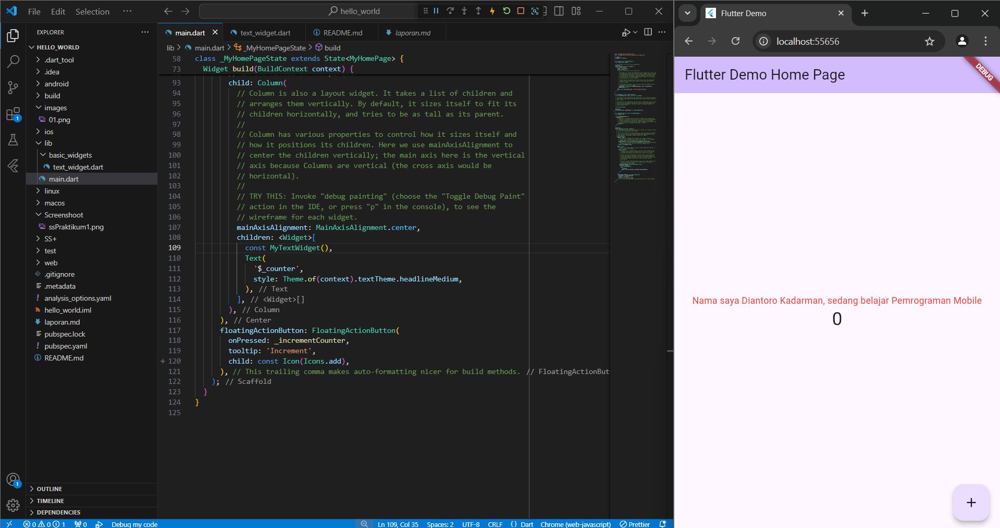

# hello_world

A new Flutter project.

## Praktikum 1

## Praktikum 2

## Praktikum 3

## Praktikum 4
### Langkah 1

### Langkah 2

## Praktikum 5
### Langkah 1: Cupertino Button dan Loading Bar

### Langkah 2: Floating Action Button (FAB)

### Langkah 3: Scaffold Widget

### Langkah 4: Dialog Widget

### Langkah 5: Input dan Selection Widget

### Langkah 6: Date and Time Pickers
